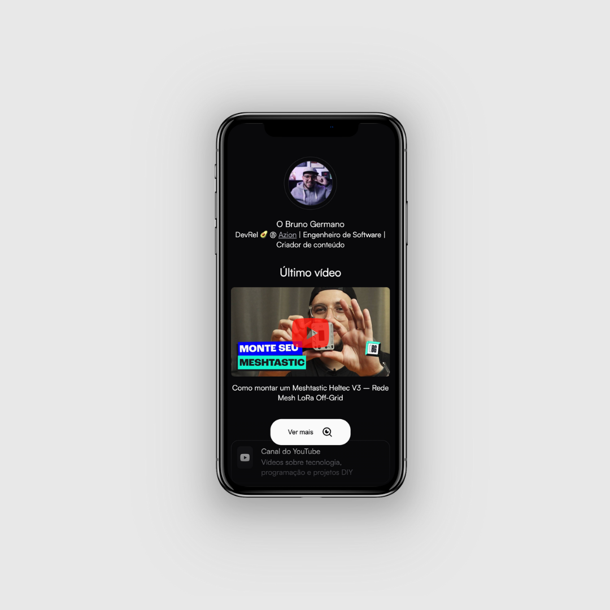

# me.egermano.com

Personal link-in-bio site built with [Astro](https://astro.build/), deployed using [Azion](https://azion.com).



## 🚀 Project Structure

```
.
├── public/
│   └── favicon.svg
├── src/
│   ├── assets/
│   │   ├── screenshot-app.png
│   │   └── user-profile-image.png
│   ├── components/
│   │   ├── LastVideo.astro
│   │   ├── Link.astro
│   │   ├── List.astro
│   │   ├── Profile.astro
│   │   └── Shadow.astro
│   ├── data/
│   │   └── user.json
│   ├── layouts/
│   │   └── Layout.astro
│   └── pages/
│       └── index.astro
├── azion/
│   ├── args.json
│   ├── azion.json
│   └── files.json
├── .edge/
│   ├── manifest.json
│   ├── worker.js
│   └── storage/
│       ├── favicon.svg
│       ├── index.html
│       └── _astro/
├── .vscode/
│   ├── extensions.json
│   └── launch.json
├── astro.config.mjs
├── azion.config.mjs
├── package.json
├── tsconfig.json
└── README.md
```

## ✏️ How to change the content?

Edit [`src/data/user.json`](src/data/user.json) to update your name, profession, and links.  
You can use any [Remixicon](https://remixicon.com/) icon by specifying its name in the `"icon"` field of each link.

## 🧑‍💻 Local Development

Install dependencies:

```sh
npm install
```

Start the local dev server:

```sh
npm run dev
```

Build for production:

```sh
npm run build
```

Preview the production build locally:

```sh
npm run preview
```

## 🚀 Deployment

This project is configured for deployment on [Azion Edge Functions](https://azion.com/).  
Configuration files: [`azion.config.mjs`](azion.config.mjs), [`azion/azion.json`](azion/azion.json), and [`.edge/manifest.json`](.edge/manifest.json).

## 📝 License
